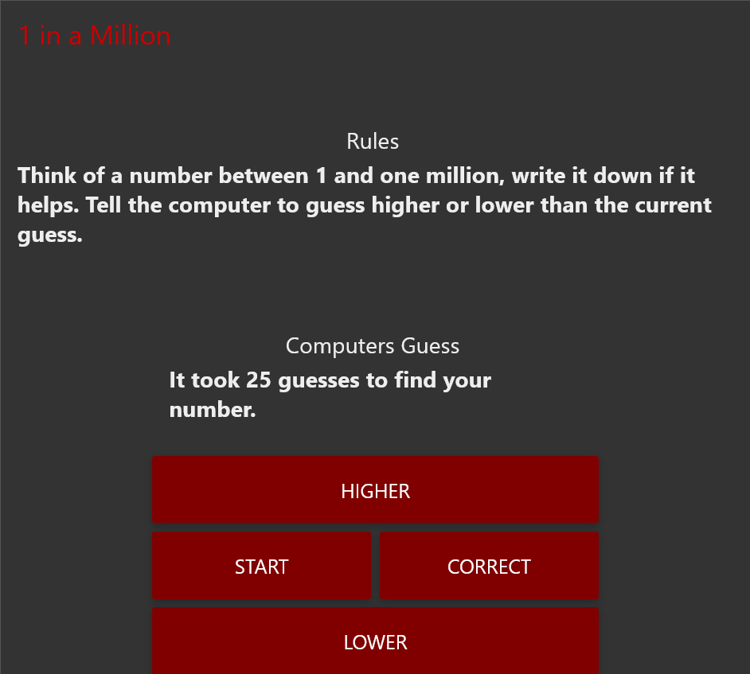

# NumberGuessGame
Think of a number between 1 and one million, write it down if it helps. Tell the computer to guess higher or lower than the current guess.

# Instructions - Import into Node-Red
This flow can be imported into the Node-Red editor using the ```flow.json``` file.

In the editor, select the ```Import``` menu option or press ```ctrl-i``` to bring up the import dialog.

The Import dialog can be used to import a flow by the following methods:

    pasting in the flow JSON directly,
    uploading a flow JSON file,
    browsing the local flow library,
    browsing the example flows provided by installed nodes.

After pasting the contents of ```flow.json``` click the ```Import``` button and click ```Deploy``` to deploy the flow.

## Screenshot

